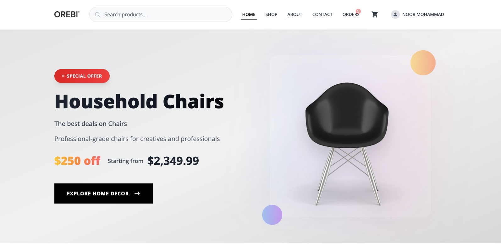

# 🛒 Orebi Shopping - Full Stack E-commerce Platform

A complete, production-ready e-commerce solution built with modern technologies including React.js, Node.js, Express, MongoDB, Redux Toolkit, Tailwind CSS, and Stripe payment integration.



## 🌟 Features

### Customer Features

- **Product Catalog**: Browse products with advanced filtering and search
- **Shopping Cart**: Add/remove items with real-time updates
- **User Authentication**: Secure login/register system
- **Order Management**: Place orders, track order history
- **Payment Integration**: Secure Stripe payment processing
- **Responsive Design**: Works perfectly on all devices
- **FAQ Section**: Comprehensive help section
- **Blog Page**: Coming soon functionality

### Admin Features

- **Dashboard Analytics**: Sales metrics and business insights
- **Product Management**: Add, edit, delete products with image upload
- **Order Management**: View and manage customer orders
- **User Management**: Manage customer accounts
- **Brand & Category Management**: Organize products efficiently
- **Contact Management**: Handle customer inquiries
- **Inventory Tracking**: Real-time stock management
- **Refresh Functionality**: One-click data refresh across all pages

### Technical Features

- **Database Migration**: Complete export/import system for MongoDB
- **Environment Configuration**: Separate development/production configs
- **CORS Policy**: Production-ready cross-origin resource sharing
- **Order Count Badges**: Real-time order notifications
- **Custom Skeleton Loading**: Smooth loading experiences
- **React Icons**: Modern icon system
- **Redux State Management**: Centralized state management

## 🏗️ Architecture

This is a full-stack application with three main components:

```
📁 Project Structure
├── 📁 client/          # React.js Frontend (Customer)
├── 📁 admin/           # React.js Admin Panel
├── 📁 server/          # Node.js Backend API
└── 📄 README.md        # This file
```

## 🚀 Quick Start Guide

### Prerequisites

Before you begin, ensure you have the following installed:

- **Node.js** (v18 or higher) - [Download here](https://nodejs.org/)
- **MongoDB** account - [Sign up at MongoDB Atlas](https://www.mongodb.com/cloud/atlas)
- **Cloudinary** account - [Sign up here](https://cloudinary.com/)
- **Stripe** account - [Sign up here](https://stripe.com/)

### 1. Project Setup

After purchasing and downloading the code:

```bash
# Extract the downloaded ZIP file
# Navigate to the project directory
cd orebishopping-vitejs

# Install dependencies for all components
# For Server
cd server
npm install

# For Client
cd ../client
npm install

# For Admin
cd ../admin
npm install
```

### 2. Environment Variables Setup

You'll need to create environment files for each component. **These are not included for security reasons.**

#### 🔧 Server Environment Variables

Create `server/.env` file:

```env
# Database Configuration
MONGODB_URI=your_mongodb_connection_string

# JWT Configuration
JWT_SECRET=your_super_secret_jwt_key_here
JWT_REFRESH_SECRET=your_refresh_token_secret
JWT_EXPIRES_IN=7d
JWT_REFRESH_EXPIRES_IN=30d

# Session Configuration
SESSION_SECRET=your_session_secret_key

# Cloudinary Configuration (for image uploads)
CLOUDINARY_CLOUD_NAME=your_cloudinary_cloud_name
CLOUDINARY_API_KEY=your_cloudinary_api_key
CLOUDINARY_API_SECRET=your_cloudinary_api_secret

# Email Configuration (for notifications)
EMAIL_HOST=smtp.gmail.com
EMAIL_PORT=587
EMAIL_USER=your_email@gmail.com
EMAIL_PASS=your_app_password
EMAIL_FROM=your_email@gmail.com

# Payment Configuration
STRIPE_SECRET_KEY=sk_test_your_stripe_secret_key
STRIPE_WEBHOOK_SECRET=whsec_your_webhook_secret
PAYPAL_CLIENT_ID=your_paypal_client_id
PAYPAL_CLIENT_SECRET=your_paypal_client_secret

# URLs
CLIENT_URL=http://localhost:5173
ADMIN_URL=http://localhost:5174
PORT=8000
```

#### 🎨 Client Environment Variables

Create `client/.env` file:

```env
VITE_SERVER_URL=http://localhost:8000
VITE_STRIPE_PUBLISHABLE_KEY=pk_test_your_stripe_publishable_key
VITE_PAYPAL_CLIENT_ID=your_paypal_client_id
```

#### 👨‍💼 Admin Environment Variables

Create `admin/.env` file:

```env
VITE_SERVER_URL=http://localhost:8000
```

### 3. Getting Your Credentials

#### MongoDB Atlas Setup

1. Go to [MongoDB Atlas](https://www.mongodb.com/cloud/atlas)
2. Create a free account
3. Create a new cluster
4. Go to Database Access → Add Database User
5. Go to Network Access → Add IP Address (0.0.0.0/0 for development)
6. Go to Database → Connect → Connect your application
7. Copy the connection string and replace `<password>` with your database user password

#### Cloudinary Setup

1. Sign up at [Cloudinary](https://cloudinary.com/)
2. Go to Dashboard
3. Copy your Cloud Name, API Key, and API Secret

#### Stripe Setup

1. Create account at [Stripe](https://stripe.com/)
2. Go to Developers → API Keys
3. Copy your Publishable Key and Secret Key
4. For webhooks: Go to Developers → Webhooks → Add endpoint
5. Add endpoint URL: `http://localhost:8000/webhook/stripe`
6. Select events: `payment_intent.succeeded`, `payment_intent.payment_failed`

#### Email Setup (Gmail)

1. Enable 2-factor authentication on your Gmail account
2. Go to Google Account Settings → Security → App Passwords
3. Generate an app password for "Mail"
4. Use this app password in EMAIL_PASS

### 4. Database Setup

Initialize your database with sample data:

```bash
cd server

# Create admin user (optional)
npm run create-admin

# Seed database with sample data (optional)
npm run seed
```

### 5. Running the Application

Start all three components in different terminals:

```bash
# Terminal 1 - Start Backend Server
cd server
npm run dev
# Server runs on http://localhost:8000

# Terminal 2 - Start Client (Customer Frontend)
cd client
npm run dev
# Client runs on http://localhost:5173

# Terminal 3 - Start Admin Panel
cd admin
npm run dev
# Admin runs on http://localhost:5174
```

### 6. Access the Application

- **Customer Website**: http://localhost:5173
- **Admin Panel**: http://localhost:5174
- **API Server**: http://localhost:8000

## 📚 Additional Setup Guides

### Production Deployment

For production deployment, update your environment variables:

```env
# Production URLs
CLIENT_URL=https://yourdomain.com
ADMIN_URL=https://admin.yourdomain.com
MONGODB_URI=your_production_mongodb_uri
STRIPE_SECRET_KEY=sk_live_your_live_stripe_key
```

### Email Configuration Alternatives

If you don't want to use Gmail, you can use:

- **SendGrid**: [sendgrid.com](https://sendgrid.com/)
- **Mailgun**: [mailgun.com](https://www.mailgun.com/)
- **Amazon SES**: [aws.amazon.com/ses](https://aws.amazon.com/ses/)

### Payment Alternatives

Besides Stripe, you can also configure:

- **PayPal**: Already integrated, just add your credentials
- **Razorpay**: Popular in India - [razorpay.com](https://razorpay.com/)
- **Square**: [squareup.com](https://squareup.com/)

## 🛠️ Development Scripts

### Server Scripts

- `npm run dev` - Start development server with nodemon
- `npm run start` - Start production server
- `npm run seed` - Seed database with sample data
- `npm run create-admin` - Create admin user

### Client/Admin Scripts

- `npm run dev` - Start development server
- `npm run build` - Build for production
- `npm run preview` - Preview production build

## 📖 API Documentation

Once the server is running, visit: http://localhost:8000/api-docs

## 🎯 Key Technologies Used

- **Frontend**: React.js, Vite, Tailwind CSS, Redux Toolkit
- **Backend**: Node.js, Express.js, MongoDB, Mongoose
- **Authentication**: JWT tokens
- **File Upload**: Cloudinary
- **Payments**: Stripe, PayPal
- **Email**: Nodemailer
- **State Management**: Redux Toolkit
- **Styling**: Tailwind CSS
- **Icons**: React Icons

## 🔧 Troubleshooting

### Common Issues

1. **CORS Errors**: Make sure your CLIENT_URL and ADMIN_URL match your running ports
2. **Database Connection**: Verify your MONGODB_URI and network access settings
3. **Image Upload Issues**: Check your Cloudinary credentials
4. **Payment Issues**: Ensure Stripe keys are correct and webhook is configured

### Getting Help

If you encounter any issues:

1. Check the console logs for error messages
2. Verify all environment variables are set correctly
3. Ensure all dependencies are installed
4. Check that all required services (MongoDB, Cloudinary, Stripe) are properly configured

## 🎉 What You Get

After purchase, you'll receive:

- ✅ Complete source code for all three applications
- ✅ This comprehensive setup guide
- ✅ Database seed scripts with sample data
- ✅ Production-ready configuration
- ✅ API documentation
- ✅ Admin panel with full management features
- ✅ Customer-facing e-commerce website
- ✅ Payment integration (Stripe + PayPal)
- ✅ Email notification system
- ✅ Image upload functionality
- ✅ Responsive design for all devices

## 🌟 Perfect For

- **Entrepreneurs** starting an e-commerce business
- **Developers** learning full-stack development
- **Students** working on projects
- **Agencies** needing a quick e-commerce solution
- **Freelancers** delivering client projects

## 💰 Purchase

Get the complete source code at: **[Your BuyMeACoffee Link]**

---

**Built with ❤️ by [Your Name]**

_Need custom modifications or have questions? Contact me at [noor.jsdivs@gmail.com]_
